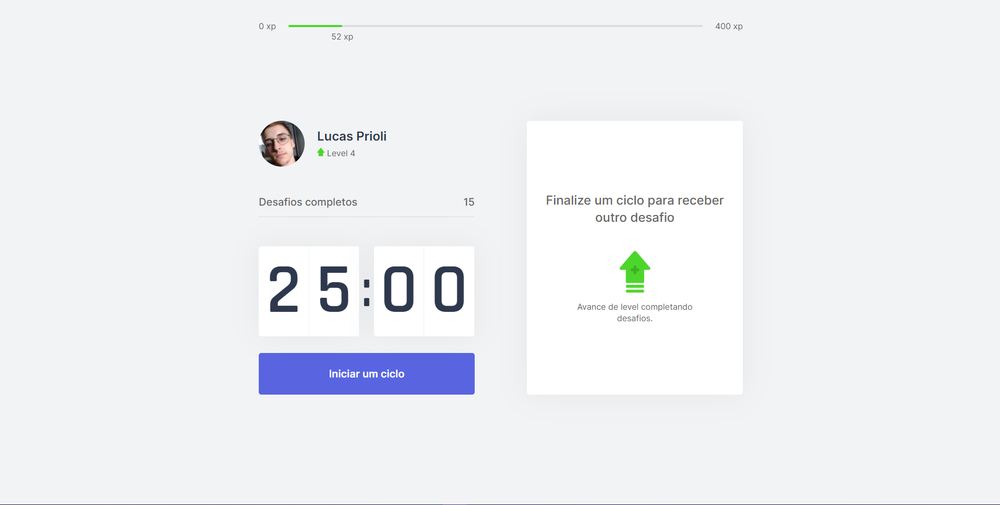
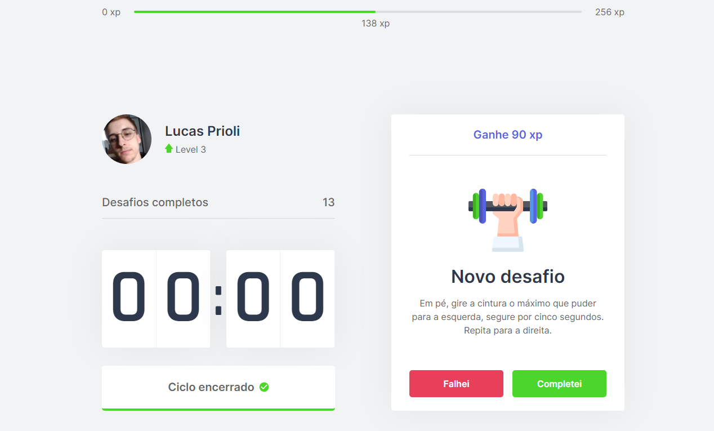
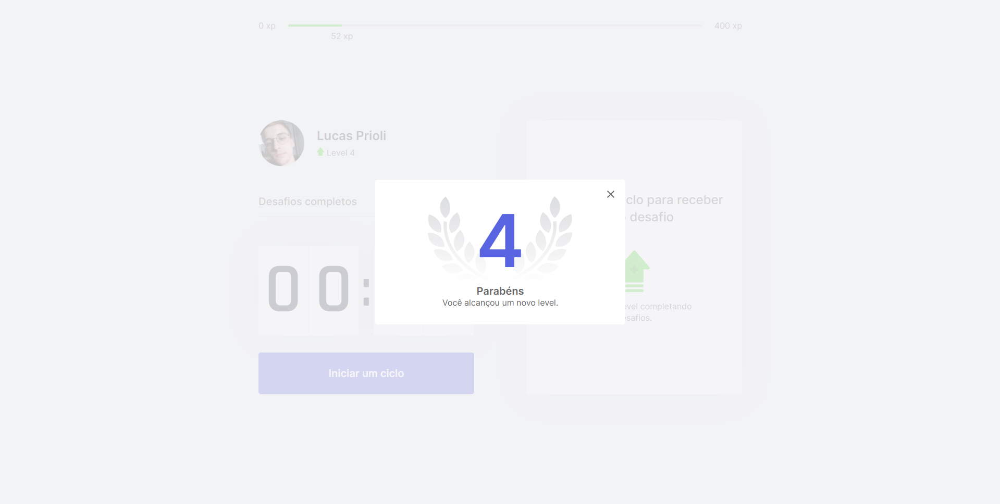

<p align="center">
  
</p>

Next Level Week #04 #NLW @Rocketseat

  <sub>Construído por
    <a href="https://github.com/priolilucas1">Lucas Prioli</a>
  </sub>
  
<h2>🖥 Interface web:</h2>

<p>
  
  
  
</p>


<h2 align="left"> Download do Layout: </h2>
<p align="center">
    <a title="Download .fig Web" href="https://www.figma.com/file/ge20pu3ofMOKoliUyKx1Nl/?viewer=1&node-id=160:2761">
        
    </a>
</p>

# 🛠 Tecnologias:

* [React](https://reactjs.org/)
* [Next.js](https://nextjs.org/) 
* [Typescript](https://www.typescriptlang.org/)                 

# 🚩 Como utilizar o projeto
```bash
# Clone no repositório
$ git clone https://github.com/priolilucas1/Move.it.git
```

### Rodar o projeto

```bash
# Instalar dependências
$ yarn install

# Rodar aplicação
$ yarn dev
```
Vá para http://localhost:3000/ para ver os resultados.
